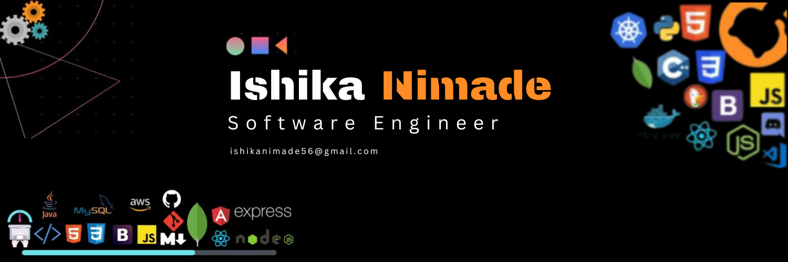

<h3 align="center">🚀 Android Developer | Crafting Digital Experiences 📱</h3>
<h1 align="center">Hello Folks ! </h1>

---

- I'm Ishika Nimade, a passionate software engineer with a focus on Android app development.
- With a year of experience, I'm dedicated to crafting captivating user experiences through code.
- I love transforming ideas into seamless mobile applications that users adore.
- I’m looking to expand my collaborations on native and/or cross-platform development.

---

<h1 align="center">🔧  Tools & Technologies</h1>

  <table >
    <thead>
      <tr>
        <th colspan="7">Languages & Frameworks</th>
      </tr>
    </thead>
    <tr>
     <td align="center" width=110>
     </td>
     <td align="center" width=110>
     </td>
     <td align="center" width=110>
     </td>
     <td align="center" width=110>
     </td>
     <td align="center" width=110>
     </td>
     <td align="center" width=110>
     </td>
     <td align="center" width=110>
     </td>
     </tr>
    <tr>
     <td align="center" width=110>Kotlin</td>
     <td align="center" width=110>Java</td>
     <td align="center" width=110>Fast-API</td>
     <td align="center" width=110>SQLite</td>
     <td align="center" width=110>MySQL</td>
    <td align="center" width=110>Android Native</td>
     <td align="center" width=110>React Native</td>
    </tr>
  </table>
   <table>
     <thead>
      <tr>
       <th colspan="7">Tools</th>
      </tr>
     </thead>
     <tr>
      <td align="center" width=110>
      </td>
      <td align="center" width=110>
       </td>
       <td align="center" width=110>
      </td>
      <td align="center" width=110>
      </td>
       <td align="center" width=110>
       </td>
  <td align="center" width=110>
       </td>
    </tr>
     <tr>
      <td align="center" width=110>Git</td>
      <td align="center" width=110>GitHub</td>
      <td align="center" width=110>IntelliJ</td>
      <td align="center" width=110>VSCode</td>
      <td align="center" width=110>JetBrains</td>
<td align="center" width=110>Mongodb</td>
     </tr>
     <tr>
       <td align="center" width=110>
      </td>
      <td align="center" width=110>
      </td>
      <td align="center" width=110>
      </td>
      <td align="center" width=110>
      </td>
        <td align="center" width=110>
       </td>
    <td align="center" width=110>
      </td>
     </tr>
     <tr>
      <td align="center" width=110>Android Studio</td>
      <td align="center" width=110>Visual Studio</td>
      <td align="center" width=110>Eclipse</td>
      <td align="center" width=110>Google Cloud</td>
<td align="center" width=110>Firebase</td>
      <td align="center" width=110>CodePen</td>
     </tr>
  </table>
  <table>
    <thead>
      <tr>
        <th colspan="7">Operating Systems</th>
      </tr>
    </thead>
    <tr>
     <td align="center" width=110>
     </td>
     <td align="center" width=110>
     </td>
    <td align="center" width=110>
     </td>
    </tr>
    <tr>
     <td align="center" width=110>Windows</td>
     <td align="center" width=110>Linux</td>
     <td align="center" width=110>Android</td>
    </tr>
  </table>

<h1 align="center">🤝 Let's Collaborate</h1>
Excited to connect with fellow developers, designers, and innovators. Let's work together to build amazing mobile experiences that make a difference. Reach out and let's create something awesome! 🚀📱

<h1 align="center">🌐 Connect with Me:</h1>
<em>
let's get in touch!
</em>

